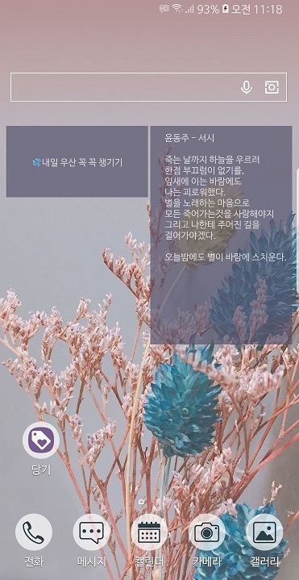
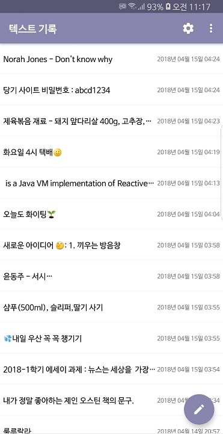
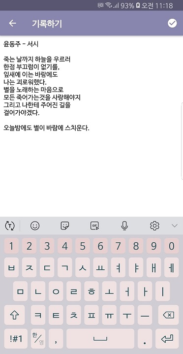
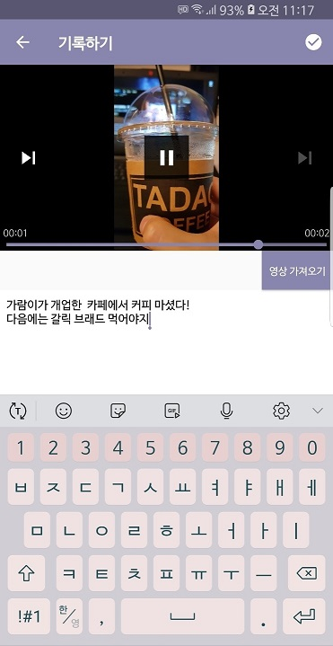

# DangGi(당신의 기록)
> 당신이 만드는 기록, 당기 

 

## :mag: 주요기능
* 텍스트 메모를 작성하고 다른 이와 공유해보세요.
* 동영상 메모를 작성하고 다른 이와 공유해보세요.
* 위젯을 등록해 중요한 내용은 꼭 기억하세요.

  
## :iphone: 미리보기
* **위젯 등록하기**

  

* :page_with_curl: **내 기록 보기**

  

* :pencil2: **기억하고 싶은 것들 담기**

  

## 사용언어
>* Java
>* Kotlin

## 사용 아키텍처
>* MVC(Model-View-Controller)

## 사용 라이브러리
>* [RxAndroid](https://github.com/ReactiveX/RxAndroid)
>* [RxKotlin](https://github.com/ReactiveX/RxKotlin)

### 버전 정보
>* 1.0v
