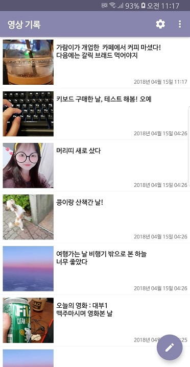

# DangGi(당신의 기록)
> 당신이 만드는 기록, 당기

### 주요기능
* 텍스트 메모를 작성하고 다른 이와 공유해보세요.
* 동영상 메모를 작성하고 다른 이와 공유해보세요.
* 위젯을 등록해 중요한 내용은 꼭 기억하세요.

### 미리보기
* **내 기록 보기**

* **기억하고 싶은 것들 담기**

* **위젯 등록하기**

### 개발언어
* Java
* Kotlin
